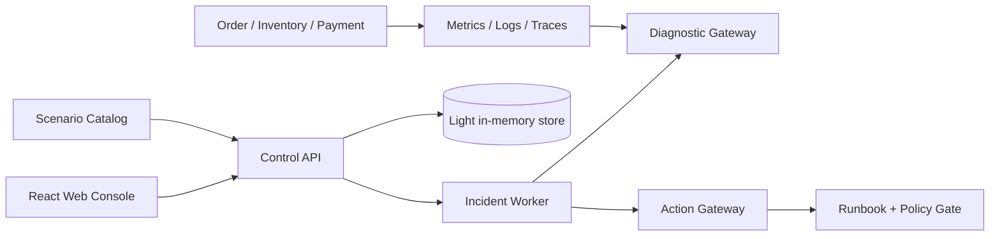

# Sentinel-X

Sentinel-X 是一个面向隔离演练环境的 AI 事故指挥平台原型。它把异常发现、证据收集、根因假设、人工审批、受控恢复和事故回放组织成一条可审计的工作流。

它不是普通聊天机器人，也不允许模型获得任意 Shell、`kubectl` 或生产集群写权限。

> 当前状态：`D1-light` 本地原型。Control API、Action Gateway、Incident Worker、诊断工具、演练微服务和 React 控制台已经可以本地运行；单场景 Temporal durable thin slice 已通过 SDK 测试服务器执行与 history replay，完整多场景 Kubernetes/Temporal、PostgreSQL 持久投影、全量 OpenTelemetry 和固定 benchmark 仍未完成。

## 30 秒演示

1. 打开事故指挥室，载入 4 条演示事故。
2. 进入“演练场景”，启动一个固定故障。
3. 在事故详情中查看 Prometheus、Loki、Tempo 风格的证据、根因假设和调查时间线。
4. 检查 R1 Runbook 的目标、参数、风险等级、过期时间和 plan hash。
5. 人工批准后，light fixture 会写入执行、恢复验证和回放事件。

核心链路：

```text
异常信号 -> 证据关联 -> 根因假设 -> 恢复方案 -> 人工审批
    -> 受控执行 -> 恢复验证 -> 事故回放与评测
```

## 为什么做这个项目

真实故障处理经常需要在告警、指标、日志、Trace、服务状态和发布记录之间来回切换。Sentinel-X 用固定故障和可引用证据展示一种更可解释的 Agent 工程模式：AI 负责调查和提出计划，人负责授权有影响的动作，系统记录每一步为什么发生。

## 主要能力

| 能力 | 当前 light 原型 | 说明 |
| --- | --- | --- |
| 事故指挥室 | 已实现 | 事故队列、服务拓扑、状态摘要、待审批提示 |
| 事故详情 | 已实现 | 证据、根因假设、审批记录、SSE 时间线和恢复事件 |
| 故障演练目录 | 已实现 | 6 个固定场景，启动后创建可回放事故 |
| 诊断工具边界 | 已实现并测试 | Prometheus、Loki、Tempo、Kubernetes 只读工具的参数约束 |
| 人工审批 | light 原型已测试 | 角色门控、完整计划核对、理由化拒绝和 fixture 时间线；不是生产身份认证 |
| Action Gateway | light 原型已测试 | fail-closed、HMAC 审批凭证、管理员令牌、Runbook/目标/参数/hash/过期和内存并发幂等；可选 SQLite 审批记录已覆盖重启恢复与原子消费；不执行真实 Kubernetes 动作 |
| 固定评测 | 设计中 | 评测 runner 和指标定义存在，完整 benchmark 尚未发布 |
| Kubernetes / OTel 全栈 | proposed | 清单和架构草案存在，尚未作为完成能力声明 |

## 架构概览



目标架构会把 Control API/Action Gateway 的本地内存或 SQLite 存储收敛为 PostgreSQL，把异步 fixture 收敛到 Temporal，并在隔离 Kubernetes 集群中接入真实的观测查询和受限执行器。目标架构不等于当前已完成能力。

## 快速开始

### 环境

- Python `>= 3.13`
- Node.js 和 npm
- Git
- Docker Desktop、k3d/kind 只在尝试 full profile 时需要

### 安装

在仓库根目录执行：

```powershell
python -m venv .venv
.\.venv\Scripts\Activate.ps1
python -m pip install --upgrade pip
python -m pip install -e packages/contracts -e packages/domain -e packages/diagnostics -e packages/policy
python -m pip install -e apps/control-api -e apps/incident-worker -e apps/action-gateway
python -m pip install -e demo/services
Set-Location apps/web-console
npm ci
Set-Location ..\terminal-console
npm ci
```

### 启动控制面和控制台

打开两个终端。

终端一：

```powershell
python -m uvicorn sentinel_x_control_api.app:app --host 127.0.0.1 --port 8000
```

终端二：

```powershell
Set-Location apps/web-console
npm run dev -- --host 127.0.0.1 --port 5173
```

浏览器打开 <http://127.0.0.1:5173>。

控制台通过 Vite proxy 访问 `http://127.0.0.1:8000`。如果端口被占用，请先停止占用项目端口的进程，再按文档启动，避免把未知服务误当成演练环境。

控制台默认以 `viewer` 只读角色启动。需要启动演练时，在启动 Vite 前设置本地开发角色：

```powershell
$env:VITE_SENTINEL_ROLE = 'scenario_operator'
npm run dev -- --host 127.0.0.1 --port 5173
```

审批操作使用 `approver`；这些环境变量只用于本地 light 演练展示，不能当作生产身份认证。

可选的终端控制台复用同一个 Control API。保持终端一中的控制面运行，再打开新终端：

```powershell
Set-Location apps/terminal-console
npm run dev
```

方向键切换总览、审批、演练和系统视图，`r` 刷新，`q` 退出。该界面当前是只读 prototype；审批决定和场景启动仍使用 Web 控制台或受控 API，不在终端界面中提供绕过入口。

面向 Agent 或管道使用机器可读模式：

```powershell
npm run dev -- --output json --fields health,incidents
npm run dev -- --describe
npm run dev -- --dry-run --api-url http://127.0.0.1:8000
```

## 验证

根目录快速测试：

```powershell
python -m pytest -v --tb=short --asyncio-mode=auto
```

前端类型检查和生产构建：

```powershell
Set-Location apps/web-console
npm run build
npm run lint
Set-Location ..\terminal-console
npm test
npm run build
```

Action Gateway 和诊断边界测试：

```powershell
python -m pytest apps/action-gateway/tests packages/diagnostics/tests -v --tb=short --asyncio-mode=auto
```

演练微服务测试使用动态回环端口、health readiness 和可靠 teardown，建议单独执行：

```powershell
python -m pytest demo/services/tests/test_services.py -v --tb=short --asyncio-mode=auto
```

测试通过只代表对应命令覆盖的范围，不代表完整 Kubernetes/Temporal/观测栈端到端验收已经完成。

## 安全边界

- 只面向本地隔离演练环境，不连接真实生产系统、生产告警或生产数据。
- 诊断默认只读；日志、Trace、告警和工具结果都被视为不可信输入。
- `POST /api/incidents` 是 Alert Ingress，要求 `X-Sentinel-Timestamp` 和 `X-Sentinel-Signature`；未配置 `ALERT_INGRESS_HMAC_KEY` 时拒绝请求。
- 禁止任意 Shell、`kubectl`、`pods/exec`、Secrets 读取、`cluster-admin` 和跨 namespace 写操作。
- MVP 的 R1 动作只有登记过的 Deployment 重启和限定范围扩容，并且必须人工批准。
- light Action Gateway 默认 kill switch 开启；未配置 `SENTINEL_APPROVAL_TOKEN_SECRET` 或管理员令牌时拒绝受控动作。
- Control API 的 `X-Sentinel-Role` 是本地演示能力门控，不是浏览器会话、OIDC 或服务身份认证。
- R2 数据库/跨服务高风险动作在 MVP 中禁用，R3 永久禁止。
- Action Gateway 不持有模型密钥，模型组件不持有执行器写权限。

## 项目结构

```text
apps/
  control-api/       事故、场景、审批和 SSE API
  action-gateway/    独立动作门控与 Runbook 执行器
  incident-worker/   可测试的事故 Workflow fixture
  terminal-console/  Ink + JSON spec 终端控制台
  web-console/       React + TypeScript 控制台
demo/
  services/          order / inventory / payment 演练服务
  scenarios/         固定故障 YAML 与场景加载器
packages/
  contracts/         Pydantic 契约
  domain/            事故状态机和领域服务
  diagnostics/       只读诊断工具定义与结果脱敏
  policy/             风险等级和策略校验
docs/                 产品、架构、安全、测试、运维和发布文档
evals/                固定评测 runner 与指标定义
infra/                Kubernetes、OTel、Prometheus 等清单草案
```

## 文档入口

- [文档地图与阅读顺序](docs/README.md)
- [产品需求与验收](docs/product-requirements.md)
- [系统架构](docs/architecture.md)
- [API 契约](docs/api-contracts.md)
- [安全模型](docs/security-model.md)
- [场景目录](docs/scenario-catalog.md)
- [测试与评测设计](docs/testing-and-evaluation.md)
- [本地开发与部署](docs/local-development-and-deployment.md)
- [10 分钟演示手册](docs/demo-runbook.md)
- [发布门禁](docs/release-readiness.md)
- [证据账本](docs/evidence-ledger.md)
- [贡献指南](CONTRIBUTING.md)
- [安全问题报告](SECURITY.md)

## Roadmap

- 收敛 `/api` 与正式 `/api/v1` 契约，补齐认证、幂等、ETag 和持久投影。
- 将审批绑定到数据库记录、目标身份、参数哈希、过期时间和一次性消费凭证。
- 将 Temporal durable thin slice 扩展到六场景，补齐 PostgreSQL migration/outbox 和 worker 重启恢复。
- 在本地隔离 Kubernetes 中完成六场景注入、cleanup、权限负向测试和观测查询。
- 发布带 dataset/profile/model/policy/SLO 版本的 holdout benchmark，不用演示数据替代评测。

## 许可证与贡献

当前仓库元数据仍标记为 `UNLICENSED`，尚未发布可复用许可证。贡献前请阅读 [CONTRIBUTING.md](CONTRIBUTING.md)、[SECURITY.md](SECURITY.md) 和 [AGENTS.md](AGENTS.md)。

所有对外指标、性能和安全结论都必须回链到可重复的命令、报告或 [证据账本](docs/evidence-ledger.md)，不能把设计目标写成已达成事实。
