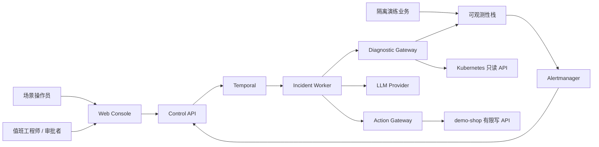
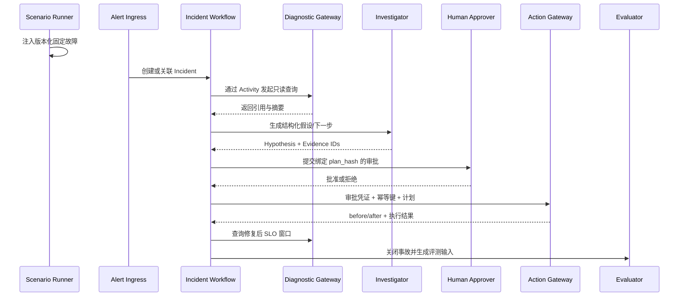

# 拟议系统架构

## 1. 状态与设计原则

本文是目标架构，所有组件均为 `proposed`，尚未经过代码和环境验证。

设计原则：

- **隔离优先**：只操作可销毁、可重建的演练环境。
- **只读优先**：调查与执行分离，模型不直接拥有写权限。
- **确定性包围概率性**：LLM 负责假设和解释，工作流、策略、审批、执行和验证由确定性代码控制。
- **证据优先**：结论必须关联原始查询和时间范围。
- **少服务**：MVP 使用模块化单体控制面，仅将 Action Gateway 独立部署。
- **可复现**：场景、模型配置、查询、计划、动作和报告均可版本化。

## 2. 系统上下文



## 3. 逻辑组件

| 组件 | 主要职责 | 明确不负责 |
| --- | --- | --- |
| Web Console | 拓扑、时间线、证据、审批、回放 | 直接调用 Kubernetes 或签发审批 |
| Control API | 事故/场景/审批 API、鉴权、SSE | 长时编排、直接执行恢复动作 |
| Alert Ingress | 校验 webhook、指纹去重、创建事故 | 根因判断 |
| Incident Worker | 调查预算、步骤编排、暂停审批、恢复验证 | 在 Workflow 内直接做外部 I/O |
| Investigator | 选择只读工具、生成结构化假设与计划 | 更改策略、执行任意命令 |
| Diagnostic Gateway | 适配 PromQL、Loki、Tempo、K8s 只读查询 | 写入集群或数据库 |
| Action Gateway | 策略与审批校验、幂等执行、审计 | 调用 LLM、接受自由文本动作 |
| Scenario Runner | 固定故障的注入、清理、ground truth | 操作 `sentinel-system` 或真实系统 |
| Evaluator | 读取演练记录并计算固定指标 | 在线控制事故流程 |

Control API 内部按 `incidents`、`scenarios`、`approvals`、`timeline` 模块组织。首版不为了“微服务化”拆分更多网络边界。

详细契约分别由 [API](api-contracts.md)、[数据模型](data-model.md)、[Workflow](workflow-design.md)、[LLM/工具](llm-and-tooling-protocol.md)、[场景](scenario-catalog.md) 和 [Runbook](runbook-specification.md) 维护。

## 4. 拟议部署拓扑

本地使用单个 k3d/kind 集群并按 namespace 隔离：

```text
sentinel-system   Control API / Worker / Action Gateway
observability     OTel Collector / Prometheus / Alertmanager / Loki / Tempo / Grafana
demo-shop         order-api / inventory-api / payment-api / PostgreSQL / Redis
sentinel-chaos    Scenario Runner / Toxiproxy
```

约束：

- `sentinel-chaos` 只能影响 `demo-shop`。
- `diagnostic-sa` 仅能 `get/list/watch` 必要资源，禁止读取 Secrets。
- `executor-sa` 只能在 `demo-shop` 对白名单 Deployment 做有限 patch。
- `sentinel-system` 和 `observability` 永远不是故障注入目标。
- namespace 使用独立 ServiceAccount、NetworkPolicy 和 ResourceQuota。
- Scenario Runner 与 Action Gateway 使用互不共享的身份：前者只管理固定 FaultInjection/cleanup，后者只执行获批 R1 Deployment 动作。

完整栈资源开销待测。开发计划保留“轻量 profile”，允许先用 fixture 替代 Loki/Tempo，但轻量路径不能冒充完整 E2E。

## 5. 核心事故数据流



任何模型、数据库、网络或 Kubernetes 调用都放入 Temporal Activity。Workflow 只保存确定性状态和 Activity 结果引用，避免重放导致重复副作用。

## 6. 事故状态机

```text
DETECTED
-> TRIAGING
-> DIAGNOSING
-> PLAN_PROPOSED
-> AWAITING_APPROVAL
-> EXECUTING
-> VERIFYING
-> RESOLVED | ESCALATED | FAILED
```

- 允许在 `DIAGNOSING` 内循环多个诊断步骤，但受步数、Token、时间和结果大小预算限制。
- Kubernetes 自动恢复或无需动作时，允许 `DIAGNOSING -> VERIFYING`；仍需完整 SLO 窗口且不能创建多余 ActionExecution。
- 不需要动作或动作被拒绝时可从 `DIAGNOSING`/`AWAITING_APPROVAL` 进入 `ESCALATED`。
- Action Gateway 失败进入 `FAILED` 或按明确策略重试，不能由模型自行改写动作绕过失败。
- 规范转换和不变量见 [领域模型与接口契约](domain-model-and-contracts.md)。

## 7. 数据与职责

| 数据 | 事实来源 | 持久化内容 |
| --- | --- | --- |
| 领域状态、审批、时间线 | PostgreSQL | 可查询的业务记录和不可变引用 |
| 工作流进度、定时器、重试 | Temporal | Workflow history |
| 指标 | Prometheus | 原始 time series；领域库只存查询和必要快照 |
| 日志 | Loki | 原始日志；领域库只存脱敏摘要、hash 和来源引用 |
| Trace | Tempo | 原始 span；领域库只存 trace/span 引用 |
| 演练标准答案 | 版本化场景文件 | 根因、证据预期、动作和恢复条件 |
| 评测报告 | 版本化运行产物 | 配置、逐项结果、聚合指标和失败原因 |

PostgreSQL 不能驱动另一套独立工作流状态机；Temporal 是流程推进的唯一来源，领域库提供读模型和审计查询。

## 8. 信任边界

1. 浏览器到 Control API：需要身份、角色和输入校验。
2. 告警入口到 Control API：需要来源认证、Schema 校验、限流和去重。
3. 遥测到 Investigator：内容是不可信数据，可能含提示注入和敏感信息。
4. Investigator 到 Action Gateway：模型输出不是授权，必须经过 Schema、策略和审批。
5. Action Gateway 到 Kubernetes：使用独立最小权限身份，只允许固定目标与动作。
6. 场景注入器到演练环境：只能操作 `demo-shop` 且必须可清理。

具体控制见 [安全模型](security-model.md)。

## 9. 内部协议与出站网络

- 浏览器只访问 Control API/Web Console；不直接访问 Kubernetes、数据库或内部 Gateway。
- Alertmanager 使用独立 HMAC webhook；注释是未信任数据。
- Worker 使用 audience 固定的短时 ServiceAccount token 调用 Action Gateway；Gateway 独立读取/消费数据库审批。
- Diagnostic Gateway 只访问配置的 Prometheus/Loki/Tempo 与 Kubernetes 只读 API，无通用 URL 工具。
- Investigator 只允许访问固定 LLM provider endpoint；Action Gateway 没有模型 egress。
- Scenario Runner 只访问登记的 demo-shop 注入目标和自身代理，不访问 Control API 的审批路径。

详细认证、超时和重试见 [API 契约](api-contracts.md)。

## 10. 可靠性设计

- 告警使用稳定指纹去重，Incident 创建使用唯一约束。
- Activity 设置明确超时和有限重试；非幂等动作不做盲目自动重试。
- ActionExecution 以 `idempotency_key` 唯一，并记录 before/after 状态。
- 审批绑定目标 UID 与 generation/resourceVersion，执行前检查审批后漂移。
- Worker 可重启恢复；模型失败、预算耗尽或证据不足时升级人工。
- 验证使用独立时间窗口，不能用“API 返回成功”代替服务恢复。
- 场景清理失败会阻止下一次 benchmark，避免残留污染数据。

## 11. 故障域

- demo-shop 服务故障不得影响 sentinel-system/observability 的 ResourceQuota 和目标选择。
- 观测源单点失败会降低 Evidence 完整性，但不能让系统误判恢复。
- PostgreSQL/Temporal 失配时开启 kill switch 并对账，不允许 Gateway 信任缓存审批。
- LLM/provider 失败只影响 AI 调查，系统保留只读事故与人工升级。
- Action Gateway 失败不应阻止 Scenario Runner 的安全 cleanup。

## 12. 技术选择边界

- Temporal 是 MVP 唯一持久编排候选；不叠加 LangGraph。
- Kubernetes 使用官方客户端，不从应用调用 `kubectl`。
- 首批故障使用应用故障开关、Toxiproxy 和有限 Kubernetes 操作；Chaos Mesh 延后评估。
- SSE 用于事故时间线推送；MVP 不需要 WebSocket 双向协议。
- OPA、Vault、对象存储只有在规则或数据规模证明需要时再引入。

这些选择在 M0 基准与首个代码骨架评审后，才从 `proposed` 转为已采用并记录 ADR。
