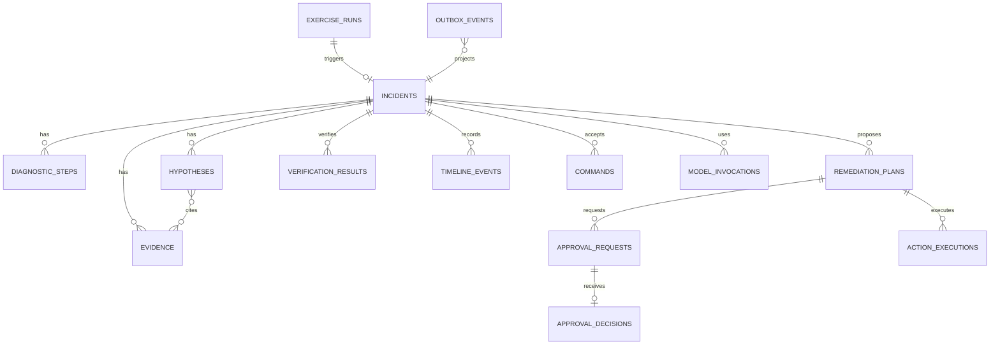

# 数据模型、事务与保留设计

## 1. 状态与职责

本文定义 PostgreSQL 目标关系模型、约束、索引、事务、outbox、审计和迁移。所有设计为 `proposed`；实现后 Alembic migrations 和数据库约束成为物理事实来源。

Temporal 保存 Workflow history 和定时器；PostgreSQL 保存外部命令、领域投影、审批、动作登记、只追加时间线和查询读模型。PostgreSQL 不驱动第二套独立事故状态机。

## 2. ER 概览

ScenarioDefinition、Runbook、policy 和 prompt 以版本化文件/发布包为配置事实，数据库只保存不可变引用和 hash，不在 UI 中原地编辑。

## 3. 公共字段约定

- ID：`text`/ULID 或 UUIDv7 的类型化应用表示；M0 选择后固定。外部不依赖可排序性。
- 时间：`timestamptz`，数据库默认 UTC。
- 枚举：数据库 `text + CHECK` 或 PostgreSQL enum 由迁移策略决定；API 保持稳定英文值。
- JSON：只有类型演进快、仍有 Schema 的 payload 使用 `jsonb`；关键查询/约束字段必须列化。
- 乐观锁：可变读模型含 `version bigint`，每次更新递增并生成 ETag。
- hash：存 `algorithm:value`，当前候选 `sha256`，不存未规范化对象的临时 hash。

## 4. 核心表

### 4.1 `exercise_runs`

| 字段 | 类型/约束 |
| --- | --- |
| `id` | PK |
| `scenario_id`, `scenario_version`, `scenario_hash` | NOT NULL，不可变引用 |
| `environment_id`, `profile` | NOT NULL |
| `status` | CHECK 生命周期枚举 |
| `fault_injection_ref` | nullable jsonb，严格应用 Schema |
| `incident_id` | nullable UNIQUE FK |
| `started_at`, `fault_active_at`, `cleanup_started_at`, `finished_at` | timestamptz |
| `dirty_reason` | nullable text，长度限制 |
| `created_by` | NOT NULL |

约束：每个 environment 最多一个 `READY/INJECTING/ACTIVE/CLEANING` run，使用 partial unique index。

### 4.2 `incidents`

| 字段 | 类型/约束 |
| --- | --- |
| `id` | PK |
| `workflow_id` | UNIQUE NOT NULL |
| `alert_fingerprint` | NOT NULL |
| `status`, `severity`, `service` | NOT NULL + CHECK |
| `exercise_run_id` | nullable UNIQUE FK |
| `projection_version` | bigint NOT NULL default 0 |
| `workflow_run_id`, `workflow_event_id` | 最近投影位置 |
| `opened_at`, `updated_at`, `closed_at` | timestamptz |
| `close_reason` | nullable |

partial unique：同 fingerprint 只允许一个非终态 Incident。终态关联新告警通过 `related_incident_ids` 连接表，不重新打开。

### 4.3 `evidence`

| 字段 | 类型/约束 |
| --- | --- |
| `id`, `incident_id` | PK / FK |
| `evidence_type`, `source`, `template_id` | NOT NULL |
| `query_parameters` | jsonb，已脱敏规范参数 |
| `range_start`, `range_end` | NOT NULL，start < end |
| `summary` | 长度限制后的不可信文本 |
| `source_ref` | allowlist 结构，不保存任意 URL |
| `content_hash` | NOT NULL |
| `truncated`, `freshness_at` | NOT NULL |
| `created_by_step_id`, `created_at` | FK / timestamptz |

唯一候选：`incident_id + evidence_type + source + template_id + content_hash`，重复 Activity 返回既有 ID。原始大遥测留在 Prometheus/Loki/Tempo。

### 4.4 `diagnostic_steps` 与 `model_invocations`

`diagnostic_steps` 保存稳定 step key、tool/template、规范参数 hash、状态、错误码、duration、result ref 和 attempt。`(incident_id, step_key)` UNIQUE。

`model_invocations` 保存 provider alias、model/version、prompt/policy/schema 版本、input/output Token、latency、status、parse attempts、cost snapshot ref 和 trace ID；不保存 API key。是否保存脱敏 prompt/output 由安全保留策略决定，默认只存 hash 与结构化结果引用。

### 4.5 `hypotheses` 与引用

`hypotheses`：id、incident、revision、statement、category、target、confidence_score、status、model_invocation_id、created_at。`(incident_id, revision, id)` 唯一。

`hypothesis_evidence`：hypothesis_id、evidence_id、relation=`SUPPORTS|CONTRADICTS`、reason；复合 PK。confidence 是模型评分，不存为统计置信区间。

### 4.6 `remediation_plans`

| 字段 | 约束 |
| --- | --- |
| `id`, `incident_id` | PK/FK |
| `runbook_id`, `runbook_version`, `runbook_hash` | NOT NULL |
| `risk_level`, `policy_version` | NOT NULL |
| `target_namespace/kind/name/uid` | NOT NULL |
| `target_observed_generation`, `target_resource_version` | NOT NULL |
| `parameters` | jsonb + Runbook Schema |
| `rationale`, `evidence_ids` | NOT NULL；Evidence IDs 再做关联表/约束 |
| `canonical_payload`, `plan_hash` | hash UNIQUE，不把秘密放入 payload |
| `status`, `created_at`, `superseded_at` | 生命周期 |

规范 hash 包含 incident、Runbook、risk、policy、目标全部身份字段和 parameters。计划变化创建新 revision，旧审批不会迁移。

### 4.7 `approval_requests` 与 `approval_decisions`

`approval_requests`：id、plan_id、plan_hash、risk、policy version、status、nonce hash、expires_at、max_executions、consumed_count、revoked_at、created_at、version。

约束：同 plan hash 最多一个 `PENDING`；`expires_at > created_at`；`consumed_count <= max_executions`。

`approval_decisions`：request_id UNIQUE/FK、approver_id、decision、reason、decided_at、request_version。只允许插入一次，不允许 update/delete。

### 4.8 `action_executions`

字段：id、incident_id、plan_id、approval_id、idempotency_key_hash UNIQUE、status、target identity、before_state_ref/hash、after_state_ref/hash、error_code、attempt_count、reconciliation_count、started_at、finished_at、version。

partial unique：同目标最多一个 `REGISTERED/VALIDATING/RUNNING/RECONCILING`。动作详情只保存 allowlist 字段，不复制完整 Kubernetes 对象。

### 4.9 `verification_results`

保存 incident、trigger type/ref、`recovery_actor`、SLO policy version、baseline/observed windows、每项 SLI 结果 jsonb（有 Schema）、passed、failure reason、created_at。

约束：Incident 进入 `RESOLVED` 的同一 Workflow 决策必须引用 passed result；`SCENARIO_RUNNER` 恢复不计 AI remediation 成功。

### 4.10 `timeline_events`

字段：id、incident_id、`sequence bigint`、event_type/schema_version、actor_type/actor_id、payload_ref、occurred_at、received_at、correlation_id、workflow_event_id。

`(incident_id, sequence)` 与 `(incident_id, workflow_event_id)` UNIQUE。应用角色只能 INSERT/SELECT。payload 大对象放关联表/对象产物，时间线只存受控摘要引用。

### 4.11 `commands`、`outbox_events`、`idempotency_records`

- `commands`：外部 command/approval/exercise 操作的不可变输入、body hash、actor、状态和 Workflow 投递状态。
- `outbox_events`：aggregate、aggregate_id、sequence、event type/version、payload、created/published/attempt；由业务事务原子插入。
- `idempotency_records`：scope、actor、route、key hash、body hash、status、response ref、expires_at；复合 UNIQUE。

消费者使用 event_id/inbox 去重；至少一次投递不应造成重复领域副作用。

## 5. 关键事务

### 5.1 告警创建

单事务：锁定 fingerprint advisory key -> 查活跃 Incident -> 创建或追加重复事件 -> 分配 timeline sequence -> 插入 outbox -> 提交。Workflow starter 消费 outbox，以确定性 Workflow ID `incident/{id}` 启动；AlreadyStarted 视为成功。

### 5.2 Workflow 投影

每次状态变化 Activity 携带 `workflow_run_id + workflow_event_id + expected_projection_version`：

1. 若 workflow_event_id 已处理，返回原 projection。
2. 校验允许状态和 version。
3. 更新 Incident 读模型。
4. 插入 timeline 和 outbox。
5. 同事务提交。

投影失败时 Activity 重试；Workflow 不依赖 SSE 发布成功推进。对账任务可从 Temporal history/显式状态快照重建缺失投影。

### 5.3 审批决定

锁定 ApprovalRequest -> 校验 pending/expiry/revocation/hash/ETag -> 插入唯一 Decision -> 更新 request 状态 -> timeline/outbox -> 提交。并发只允许一个成功。

### 5.4 Gateway 登记与消费

Gateway 事务读取 plan/approval/decision/policy view `FOR UPDATE`：

- 验证仍有效和消费次数。
- 插入或读取 idempotent ActionExecution。
- 首次登记时原子增加 `consumed_count` 并写 timeline/outbox。
- 提交后才调用 Kubernetes。

网络超时重试同 key 读取原 execution，不再次消费审批。

## 6. Temporal/PostgreSQL 一致性

| 事实 | 权威来源 | 修复方式 |
| --- | --- | --- |
| Workflow 当前决策、timer、retry | Temporal | replay/describe Workflow |
| 用户审批决定、外部 command | PostgreSQL 不可变记录 | outbox 重投 Signal |
| UI 事故状态/时间线 | PostgreSQL projection | 从 Workflow 显式快照与 history ref 重建 |
| Action 登记/审批消费 | Gateway PostgreSQL 事务 | Gateway 对账 + K8s before/after 协调 |
| 原始遥测 | Prometheus/Loki/Tempo | source_ref 重新查询，受保留期限制 |

不做分布式事务。所有跨系统边界使用稳定 ID、幂等和可对账状态。漂移检测输出指标和审计事件，不能静默覆盖人工决定。

## 7. 索引策略

初始必需索引：

- incidents：status/updated、service/opened、active fingerprint partial unique。
- timeline：incident/sequence covering。
- evidence：incident/type/created、content hash unique。
- approvals：pending/expires、plan hash partial unique。
- actions：idempotency unique、target active partial unique、incident/start。
- outbox：unpublished created partial index。
- commands/idempotency：delivery status/created、expires cleanup。
- exercise：environment active partial unique、scenario/start。

不为低选择性枚举盲目建单列索引；真实查询通过 `EXPLAIN (ANALYZE, BUFFERS)` 决定调整。

## 8. 审计不可变性

- 时间线、ApprovalDecision 和关键安全拒绝只允许专用 DB role INSERT/SELECT，无 UPDATE/DELETE。
- 修正错误通过追加 `*.corrected` 事件指向原记录。
- 数据库管理员仍是本地可信边界，MVP 不宣称防 DB 超级用户篡改。
- 事故包记录行数、时间范围、schema 版本和内容 hash，导出前脱敏。

## 9. 数据分类与保留

| 分类 | 示例 | 默认处理 |
| --- | --- | --- |
| Public synthetic | 场景 ID、合成服务名 | 可进入文档/脱敏报告 |
| Internal | Incident、查询、模型元数据 | 本地访问、按 run 导出 |
| Sensitive | 遥测正文、请求属性、审批理由 | 最小化、脱敏、限时保留 |
| Secret | API key、Cookie、SA token、数据库密码 | 不入业务表/日志/报告 |

初始目标：原始遥测 7 天，领域审计与脱敏报告 30 天，幂等记录至少 7 天。实现前根据磁盘和安全评审固化；清理使用明确 run/日期范围，不接受根目录或全库通配。

## 10. 迁移

- Alembic 线性 migration；每次 migration 有 upgrade、可行 rollback 说明和数据风险。
- expand/contract：先加 nullable/兼容字段，双读或回填，再收紧约束；本地 MVP 仍禁止在同一步删除仍被旧 Worker 读取字段。
- 长回填分批、可恢复、记录进度，避免单事务锁全表。
- Workflow/事件/数据库 Schema 版本分别记录，部署检查兼容矩阵。
- Scenario/Runbook/prompt/policy 版本不由数据库 migration 隐式改写。

## 11. 备份与恢复目标

本地演练目标而非生产承诺：

- 开发者可创建 PostgreSQL 逻辑备份，备份不含外部秘密。
- 恢复到新数据库实例，运行 migration 后校验约束、行数和 hash。
- Temporal 与 PostgreSQL 恢复点不一致时，不自动继续写动作；先运行对账并开启 kill switch。
- 原始遥测可按保留期丢失，Evidence 显示 source expired，而不是伪造内容。

## 12. 数据验收

- 所有状态、风险、ID、时间和 hash 约束有 migration/模型测试。
- 告警、投影、审批和 Action 登记四个关键事务有并发测试。
- Activity/Signal/outbox 至少一次投递不会产生重复 Timeline/Decision/Action。
- 投影丢失、outbox 积压和 Workflow/DB 漂移可以检测与重建。
- 审计表应用角色无法 update/delete，敏感/秘密模式不会进入导出包。
- migration 在空库和前一版本样本库通过；失败恢复路径有记录。
- 备份恢复后只读事故和审批历史一致，未对账前写动作被 kill switch 阻止。
