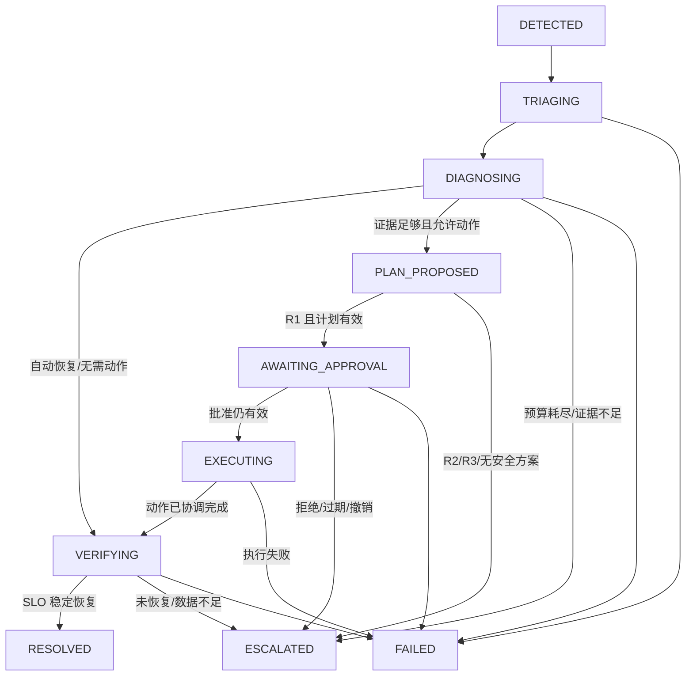

# Temporal Workflow 与持久运行时设计

## 1. 设计目标

Temporal 是 MVP 唯一持久编排候选，负责长时间调查、定时器、Activity 重试、人工审批等待和 Worker 重启恢复。Workflow 代码只做确定性决策；所有数据库、模型、网络、时钟读取和 Kubernetes I/O 必须通过 Activity 或 Workflow API。

本文均为 `proposed`，需 M0 spike 验证后以 ADR 固定。

## 2. Workflow 类型与 ID

| Workflow | ID | 作用 |
| --- | --- | --- |
| `IncidentWorkflow` | `incident/{incident_id}` | 从告警分诊到关闭事故 |
| `ExerciseWorkflow` | `exercise/{exercise_run_id}` | 场景前置、自检、注入、硬超时和 cleanup |

同一 ID 重复 Start 使用 `REJECT_DUPLICATE`/等价安全策略；starter 遇到 AlreadyStarted 读取既有 run，不创建新业务对象。

### Incident 输入

- `incident_id`
- `alert_ref` 与 fingerprint
- `exercise_run_id`（可空）
- `workflow_schema_version`
- 初始 investigation/policy/SLO budget refs

只传小型不可变引用，不把原始告警、日志或模型 prompt 放入 history。

### Incident 结果

- terminal status
- close reason
- selected hypothesis/plan/action/verification refs
- final projection version
- `history_chain`（发生 continue-as-new 时）

## 3. 事故流程

规范状态枚举仍由 [领域契约](domain-model-and-contracts.md) 维护。新增的 `DIAGNOSING -> VERIFYING` 用于 Kubernetes 自动恢复或无需外部动作的场景，仍必须产生 VerificationResult。

## 4. Incident Workflow 确定性状态

Workflow 内只保存：

- 当前规范状态和状态 revision。
- 已处理 command/signal IDs 的有界集合或滚动摘要。
- investigation budget 消耗计数。
- 当前 Evidence/Hypothesis/Plan/Approval/Action/Verification refs。
- timer deadlines 和 policy/Runbook/prompt/SLO version refs。
- projection version 与最后成功 workflow event ID。
- kill switch 最后观察状态（执行前 Activity 必须重新读取权威值）。

不保存原始大查询结果、秘密、完整 Kubernetes 对象或任意模型自由文本。

## 5. Activities

| Activity | 外部副作用 | 幂等键/策略 |
| --- | --- | --- |
| `project_incident_state` | PostgreSQL 投影、timeline/outbox | `workflow_run_id:event_id`，可安全重试 |
| `load_incident_context` | 只读 PostgreSQL | 无副作用，可重试 |
| `run_triage` | 只读查询 + 结构化结果持久化 | `incident:triage_revision` |
| `run_diagnostic_step` | 遥测查询 + Evidence 持久化 | `incident:step_key` |
| `invoke_investigator` | LLM 调用 + invocation 记录 | 每 attempt 单独记录；决策 revision 去重 |
| `validate_and_store_plan` | policy/Schema + PostgreSQL | `incident:plan_revision` |
| `create_approval_request` | PostgreSQL + outbox | `plan_hash` partial unique |
| `load_approval_decision` | 只读权威决定 | 无副作用 |
| `execute_action` | 调用 Action Gateway | 固定 `idempotency_key`；超时后协调 |
| `query_action_status` | Gateway 只读 | 无副作用 |
| `run_verification` | 遥测查询 + VerificationResult | `incident:verification_revision` |
| `finalize_evaluation_input` | 生成小型评测引用 | `incident:terminal_revision` |
| `check_kill_switch` | 只读权威状态 | 执行前强制调用 |

Exercise Activities：`check_environment`、`apply_fault`、`confirm_fault_active`、`cleanup_fault`、`confirm_environment_clean`。每个注入/清理使用 run ID 和目标身份幂等；与 Action Gateway 凭据隔离。

## 6. Signal、Query 与命令

### Signals

| 名称 | payload | 处理 |
| --- | --- | --- |
| `external_command_received` | `command_id` | 从 PostgreSQL读取权威命令，按 ID 去重 |
| `approval_decision_recorded` | `approval_request_id` | 读取不可变决定，不信任 signal 内决定值 |
| `kill_switch_changed` | `event_id` | 更新提示；执行前仍 Activity 重查 |
| `exercise_fault_active` | `exercise_run_id`, `T0_ref` | 关联运行，不含 ground truth |
| `exercise_cleanup_required` | `exercise_run_id` | 事故停止新动作并记录，不直接声明恢复 |

Signal 可以重复、乱序到达；Workflow 通过 ID 去重并检查当前状态。非法状态的命令投影为稳定拒绝事件，不静默忽略。

### Queries

- `get_status`：规范状态、revision、关键 refs。
- `get_budget`：当前使用量与上限。
- `get_pending_wait`：审批/动作/验证 deadline。
- `get_projection_checkpoint`：对账用 event/projection version。

Query 无副作用、不触发 Activity。外部 UI 仍读取 PostgreSQL 投影，不直接依赖 Temporal Query。

MVP 不使用 Workflow Update 承载用户命令，以“PostgreSQL 不可变 command + outbox + Signal”保证用户决定先落盘；后续如采用 Update 必须 ADR 说明一致性变化。

## 7. Timeout、retry 与 heartbeat

初始目标需 M0/M1 校准：

| Activity 类别 | Start-to-close | Retry | Heartbeat |
| --- | --- | --- | --- |
| PostgreSQL 读写 | 10s | 短指数，最多 5 次 | 无 |
| 遥测查询 | 20s | 仅网络/5xx，最多 3 次 | 无 |
| LLM 调用 | 60s | 限流/可重试 5xx，最多 3 次 | 无 |
| Action submit | 15s | 同幂等键最多 3 次 | 无 |
| Action reconcile | 180s | 轮询/退避到 deadline | 需要，报告最后状态 |
| Scenario inject/cleanup | 120s | 按操作幂等等级 | 长操作需要 |
| Verification | observed window + 60s | 查询错误有限重试 | 周期报告进度 |

规则：

- Schema、policy、权限、审批和目标漂移是非重试错误。
- LLM 解析修复由调查器协议限制，不依赖 Temporal 无限 retry。
- Activity retry policy 不能改变业务幂等键。
- heartbeat details 只存小型 checkpoint，不放凭据或大结果。

## 8. 错误分类

| 类别 | 示例 | Workflow 行为 |
| --- | --- | --- |
| `BUSINESS_DENIAL` | R2/R3、审批拒绝、证据不足 | `ESCALATED`，不是平台失败 |
| `VALIDATION_ERROR` | Schema、plan hash、非法状态 | 记录并升级/失败，不自动改写输入 |
| `TRANSIENT_DEPENDENCY` | DB/遥测/provider 短时失败 | 有限 Activity retry |
| `PERMANENT_DEPENDENCY` | 数据源缺失、provider 不支持 Schema | `ESCALATED` 或 `FAILED` |
| `UNKNOWN_SIDE_EFFECT` | Action 请求超时 | 进入协调，不生成新动作 |
| `NONDETERMINISM` | Workflow 代码不兼容 history | 发布门禁失败，禁止继续部署 |

## 9. 审批等待

1. Plan 持久化并投影 `PLAN_PROPOSED`。
2. 创建 ApprovalRequest，Workflow 进入 `AWAITING_APPROVAL`。
3. 使用 Workflow timer 等到 `expires_at`，同时等待 decision Signal。
4. 收到 signal 后 Activity 读取权威 request/decision。
5. 拒绝、撤销、过期或 hash/policy 变化 -> `ESCALATED`。
6. 批准 -> 执行前检查 kill switch，进入 `EXECUTING`。

timer 与 signal 竞争时以 PostgreSQL 事务中的决定/过期判定为权威；Workflow 读取结果后确定唯一分支。

## 10. 动作超时与协调

Action Gateway 是副作用事实来源。`execute_action` 使用固定 idempotency key：

- 收到 201/202：保存 execution ID；202 进入状态轮询。
- 网络超时：用同 key 重试 submit；Gateway 返回原 execution。
- 仍无法确认：调用 `query_action_status`；Workflow 保持 `EXECUTING`，不创建新 plan/key。
- Gateway `RECONCILING`：Activity heartbeat，直到 deadline。
- 结果 `SUCCEEDED`：进入 `VERIFYING`，不等于 `RESOLVED`。
- `REJECTED`：通常 `ESCALATED`；`FAILED`/状态永久未知：`FAILED` 并触发人工核实。

Worker 在 submit 前、submit 超时后或收到结果后重启，都必须通过同 key 和 execution ID 得到同一结果。

## 11. 自动恢复与无动作路径

调查期间每个关键迭代可检查 SLI/工作负载是否已恢复。若场景允许自动恢复且没有动作：

1. 记录 `remediation_kind=NONE` 与原因。
2. 进入 `VERIFYING`。
3. 完整 observed window 通过 -> `RESOLVED`。
4. 再次恶化 -> 返回 `DIAGNOSING` 仅在预算允许且状态规则明确时；MVP 可直接 `ESCALATED` 以简化。

不因告警 resolved 或 Pod Ready 单独关闭事故。

## 12. 取消、终止与补偿

- responder 的 `ESCALATE_TO_HUMAN` 在只读调查/等待审批时可请求优雅停止。
- 已提交 Action 时不能直接 cancel Workflow；先协调 Action 最终状态，再终止或升级。
- Scenario cleanup 的 hard deadline 独立于 Incident；即使 Incident Worker 失败也能撤销演练故障。
- Temporal Terminate 只用于管理员处理卡死的非副作用阶段；必须先开启 kill switch 并记录运维事件。
- compensation 只执行 Runbook 明确定义的动作，不由模型生成。

## 13. 投影、outbox 与对账

- Workflow 状态变化调用 `project_incident_state`，同事务更新读模型、timeline、outbox。
- SSE/outbox 发布失败不回滚 Workflow 决策；dispatcher 重投。
- 对账器周期比较 Temporal Query checkpoint 与 Incident projection checkpoint。
- DB 落后：调用幂等 reproject Activity 或管理 Workflow，从显式事件 refs 补齐。
- DB 超前/冲突：不覆盖，开启告警和 kill switch，由人工检查非法写入。
- Approval command outbox 未投递：dispatcher 重投同 command ID Signal。

## 14. History 大小与 continue-as-new

以下任一接近阈值时考虑 continue-as-new：history 事件数、序列化大小、调查迭代数或 Workflow 运行时长。初始软阈值目标为 1000 events/10 MiB，需用 Temporal 官方限制和 M0 实测确认。

传递到新 run 的只有确定性小型状态和 refs；`history_chain` 关联全部 run IDs。等待审批或动作协调期间不做无必要 rollover，避免丢失竞态上下文。

## 15. Workflow 版本升级

- 已运行 Workflow 必须 replay 通过新代码后才部署。
- 使用 Temporal 版本/Worker Versioning 的官方兼容机制，不能按当前时间或随机分支。
- 破坏性状态变化用新 Workflow schema/version 和迁移/continue-as-new 路径。
- Activity 输入输出向后兼容至少当前与前一版本。
- Runbook/policy/prompt 版本在 Workflow 中固定引用，不随部署静默更新。

## 16. 测试矩阵

- replay：每个历史 fixture 在新 Worker 通过 determinism 测试。
- restart：分诊、调查、等待审批、submit 前、submit 超时后、验证中重启。
- signal：重复、乱序、过期、非法状态和丢失后 outbox 重投。
- retry：DB/遥测/LLM 短暂失败与永久失败分类。
- action：201、202、超时、RECONCILING、拒绝、失败、状态未知，全程零重复副作用目标。
- projection：outbox 积压、投影落后、对账重建和冲突 kill switch。
- history：长调查触发 continue-as-new，链路和 refs 完整。
- cancellation：无副作用阶段、已提交动作阶段、Scenario hard cleanup。
- auto recovery：无 ActionExecution 仍可经完整 SLO 验证进入 `RESOLVED`。
